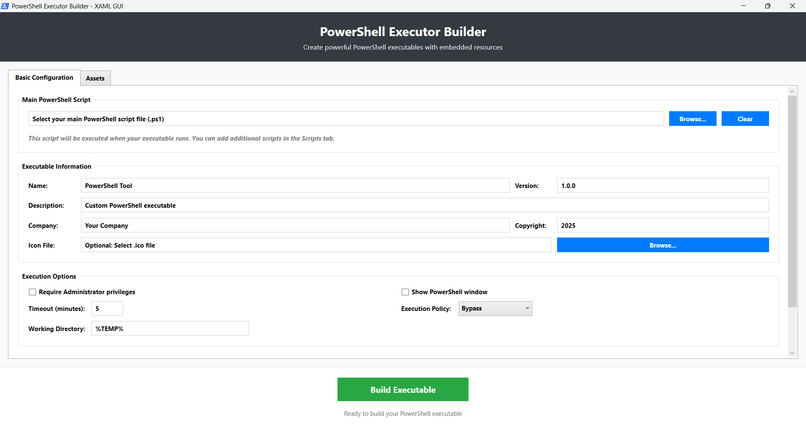

# PowerShell Executable Builder (PSEBuilder)

**A modern, GUI-based PowerShell executable builder** that creates standalone Windows executables from PowerShell scripts with embedded resources, custom icons, and professional metadata.

[](https://github.com/PowerShell/PowerShell)
[](https://dotnet.microsoft.com/)
[](LICENSE)

---

## 🚀 Key Features

- ✅ **Modern WPF GUI**: Easy-to-use graphical interface for building executables
- ✅ **Professional Dark Theme**: Eye-friendly dark mode with blue accent colors following Microsoft Fluent Design
- ✅ **PowerShell 7+ Support**: Automatic detection - prefers pwsh.exe (PS7+), falls back to powershell.exe (PS5.1)
- ✅ **Zero Dependencies**: Works on any Windows machine with PowerShell 3.0+ and .NET Framework 4.0+
- ✅ **Multi-Resource Embedding**: Scripts, images, configs, data files - all in one executable
- ✅ **Automatic Image Conversion**: JPG/PNG → ICO conversion built-in
- ✅ **Professional Metadata**: Company, version, copyright, description in exe properties
- ✅ **Icon Support**: Embed custom icons for professional appearance
- ✅ **Memory Safe**: No file locks, proper disposal, no memory leaks
- ✅ **Security Hardened**: Input validation, resource size limits, injection-proof
- ✅ **No Assembly Loading**: Direct csc.exe compilation prevents file locking issues

---

## 📸 Screenshot



*Modern dark-themed WPF interface with tabs for configuration and asset management*

---

## 🔧 Requirements

**Built-in Windows Components (No Installation Needed):**
- Windows 7+ with PowerShell 3.0+
- .NET Framework 4.0+ (included with Windows)
- **That's it!** No Visual Studio, no external packages, no complicated setup!

---

## 📖 Quick Start

### Step 1: Launch the GUI
```powershell
.\PSEBuilder.ps1
```

### Step 2: Configure Your Executable
1. **Basic Configuration Tab**:
   - Select your main PowerShell script (.ps1)
   - Set executable name, version, description, company, copyright
   - Choose icon file (optional - supports .ico, .jpg, .png, .bmp)
   - Configure execution options (admin rights, window visibility, timeout)
   - Select output location for your .exe file

2. **Assets Tab**:
   - Add any additional files: images, configs, certificates, data files
   - All files will be embedded and accessible at runtime

### Step 3: Build
- Click **"Build Executable"** button
- Wait for compilation to complete
- Your executable is ready!

### Step 4: Use Your Executable
```cmd
MyTool.exe
```

That's it! Everything is embedded in a single .exe file.

---

## 🎯 How It Works

### Build Process
1. **Resource Embedding**: Files are Base64-encoded and embedded into C# code
2. **Direct Compilation**: Uses `csc.exe` directly (no Add-Type assembly loading)
3. **Runtime Extraction**: C# wrapper extracts resources to temp directory
4. **PowerShell Detection**: Automatically searches for `pwsh.exe` (PowerShell 7+) first, then `powershell.exe` (PowerShell 5.1)
5. **PowerShell Execution**: Launches detected PowerShell version with your script
6. **Automatic Cleanup**: Temp files cleaned up after execution

### Resource Access in Your Scripts
PSEBuilder automatically provides the `Get-ResourcePath` helper function:

```powershell
# In your PowerShell script:
$imagePath = Get-ResourcePath "logo.png"
$configPath = Get-ResourcePath "config.json"

# Use the files normally
$config = Get-Content $configPath | ConvertFrom-Json
$image = [System.Drawing.Image]::FromFile($imagePath)
```

See [RESOURCE-ACCESS-GUIDE.md](docs/RESOURCE-ACCESS-GUIDE.md) for details.

---

## 💡 Example: Building a GUI App with Resources

**1. Create your PowerShell GUI script** (`my-app.ps1`):
```powershell
Add-Type -AssemblyName PresentationFramework

# Access embedded resources
$logoPath = Get-ResourcePath "logo.png"
$configPath = Get-ResourcePath "config.json"

# Build your WPF GUI...
$window = New-Object System.Windows.Window
$window.Title = "My App"
# ... rest of your GUI code
$window.ShowDialog()
```

**2. Launch PSEBuilder**:
```powershell
.\PSEBuilder.ps1
```

**3. In the GUI**:
- Browse to `my-app.ps1`
- Set Name: "My Application"
- Set Version: "1.0.0"
- Add icon: `logo.ico` (or `logo.png` - auto-converted!)
- Go to Assets tab → Add Files: `logo.png`, `config.json`
- Set output path: `MyApp.exe`
- Click **Build Executable**

**4. Distribute**:
- Single file: `MyApp.exe`
- No dependencies, no installation
- All resources embedded

See [examples/test-gui-app.ps1](examples/test-gui-app.ps1) for a complete working example.

---

## ⚙️ Configuration Options

### Basic Configuration Tab

| Setting | Description | Example |
|---------|-------------|---------|
| **Main Script** | Primary PowerShell script to execute | `scripts/main.ps1` |
| **Name** | Application name | "My PowerShell Tool" |
| **Version** | Semantic version | "1.0.0" |
| **Description** | App description | "Custom PowerShell executable" |
| **Company** | Company name | "Your Company" |
| **Copyright** | Copyright year | "2025" |
| **Icon File** | Icon for exe (auto-converts images) | `icon.ico` or `icon.jpg` |

### Execution Options

| Option | Description | Default |
|--------|-------------|---------|
| **Require Administrator** | Force UAC elevation | Unchecked |
| **Show PowerShell Window** | Visible console | Unchecked |
| **Timeout** | Max execution time (minutes) | 5 |
| **Execution Policy** | PowerShell execution policy | Bypass |
| **Working Directory** | Script working directory | %TEMP% |

### Assets Tab

Add any files to embed:
- **Images**: PNG, JPG, GIF, BMP
- **Configs**: JSON, XML, INI, CFG
- **Certificates**: PFX, CER, CRT
- **Data**: TXT, CSV, any file type
- **Size Limit**: 100MB per file

---

## 🔒 Security Features

### Input Validation
- ✅ Resource size limits (100MB per file)
- ✅ Filename validation (no path traversal)
- ✅ Timeout range validation (1-1440 minutes)
- ✅ Version format validation

### Compilation Security
- ✅ Injection-proof string escaping (handles all special characters)
- ✅ Resource key validation (alphanumeric + safe chars only)
- ✅ No code execution during build
- ✅ Separate process compilation (csc.exe)

### Runtime Security
- ✅ Temp directory isolation
- ✅ Automatic cleanup on exit
- ✅ Optional admin elevation
- ✅ Execution policy enforcement

---

## 🚫 Limitations & Considerations

### Current Limitations
- **Windows-only**: Requires Windows PowerShell and .NET Framework
- **File Icon Only**: Taskbar shows PowerShell icon (limitation of C# → PowerShell.exe architecture)
- **Temp File Storage**: Resources extracted to temp directory at runtime
- **No Digital Signing**: You must sign the exe separately if needed

### Best Practices
- Test your script standalone before building
- Keep resource files under 50MB for best performance
- Use relative paths in your scripts
- Don't hardcode absolute paths
- Test built exe on clean systems

---

## 🆚 Comparison with Similar Tools

| Feature | PSEBuilder | PS2EXE | PowerChell | Other GUI Tools |
|---------|-----------|---------|------------|-----------------|
| **GUI Interface** | ✅ Modern WPF + Dark Theme | ❌ CLI Only | ❌ CLI Only | ⚠️ Various |
| **PowerShell 7+ Support** | ✅ Auto-Detect | ⚠️ Limited | ❌ No | ⚠️ Unknown |
| **Multi-File Resources** | ✅ Yes | ❌ Single Script | ⚠️ Limited | ⚠️ Varies |
| **Image → Icon Conversion** | ✅ Automatic | ❌ No | ❌ No | ⚠️ Rarely |
| **Assembly Metadata** | ✅ Full Support | ⚠️ Basic | ⚠️ Basic | ⚠️ Varies |
| **No File Locking** | ✅ csc.exe Direct | ❌ Locks | ❌ Locks | ⚠️ Varies |
| **Memory Safe** | ✅ Try-Finally | ⚠️ Basic | ⚠️ Basic | ⚠️ Unknown |
| **Dependencies** | ✅ None | ✅ None | ✅ None | ⚠️ May Require |
| **Security Hardened** | ✅ Yes | ⚠️ Basic | ⚠️ Basic | ⚠️ Unknown |
| **Professional UI** | ✅ Dark Theme | ❌ N/A | ❌ N/A | ⚠️ Varies |

---

## 📁 Project Structure

```
Powershell_CPP/
├── PSEBuilder.ps1              # Main GUI application
├── examples/
│   ├── test-gui-app.ps1       # Example WPF GUI app with resources
│   ├── test.txt               # Example text file
│   └── image.png              # Example image file
├── docs/
│   ├── RESOURCE-ACCESS-GUIDE.md   # How to access embedded resources
│   ├── USAGE-GUIDE.md            # Detailed usage guide
│   ├── COMPREHENSIVE-DOCUMENTATION.md  # Complete reference
│   └── PowerShell-GUI-Dark-Theme-Reference.md  # Dark theme documentation
└── README.md                  # This file
```

---

## 🐛 Troubleshooting

### Build Issues

**"C# compiler (csc.exe) not found"**
- Install .NET Framework 4.0 or higher
- csc.exe should be in: `C:\Windows\Microsoft.NET\Framework64\v4.0.30319\`

**"Compilation failed with exit code 1"**
- Check debug log in `Downloads\PSEBuilder-Debug-*.log`
- Ensure your PowerShell script has no syntax errors
- Try running script standalone first

**"File is locked" error**
- Old issue - FIXED in latest version!
- Using csc.exe directly prevents file locking

### Runtime Issues

**"Resources not found in exe"**
- Resources are extracted to `$env:PS_RESOURCE_DIR`
- Use `Get-ResourcePath` helper function
- Check `Downloads\TestGUI-Runtime-*.log` for debugging

**"PowerShell icon shows in taskbar"**
- This is a known limitation of the architecture
- File icon works correctly
- Taskbar icon shows PowerShell.exe (the actual running process)
- Workaround: Create a Windows shortcut (.lnk) with custom icon

---

## 🙏 Credits & Inspiration

This project was inspired by and builds upon ideas from:

### Main Inspiration
- **[PS2EXE](https://github.com/MScholtes/PS2EXE)** by MScholtes
  - The original and most popular PowerShell → EXE converter
  - Pioneered the concept of embedding PowerShell scripts in C# wrappers
  - PSEBuilder adds GUI, multi-resource support, and advanced features

### Additional References
- **[PowerChell](https://github.com/scrt/PowerChell)** by scrt
  - Alternative PowerShell executable approach
  - Demonstrated shellcode execution techniques

- **[Reinventing PowerShell](https://itm4n.github.io/reinventing-powershell/)** by itm4n
  - Excellent deep-dive article on PowerShell executable internals
  - Inspired security hardening and architecture decisions

- **[PrivescCheck](https://github.com/itm4n/PrivescCheck)** by itm4n
  - Example of professional PowerShell tool distribution
  - Demonstrated best practices for PowerShell security

### Key Innovations in PSEBuilder
- Modern WPF GUI with professional dark theme (no command-line needed)
- PowerShell 7+ automatic detection with intelligent fallback to 5.1
- Multi-file resource embedding system
- Automatic image-to-icon conversion
- Direct csc.exe compilation (no file locking)
- Memory-safe try-finally disposal patterns
- Comprehensive security validation
- Professional assembly metadata
- Button-style controls with blue accent colors following Microsoft Fluent Design

**Thank you to all the PowerShell community members who continue to push the boundaries of what's possible!**

---

## 🤝 Contributing

Contributions welcome! Areas for improvement:

- [x] PowerShell 7+ (Core) support ✅ **Implemented!**
- [x] Dark mode UI theme ✅ **Implemented!**
- [ ] Linux/.NET Core compatibility
- [ ] Digital signature support (code signing)
- [ ] AES encryption for sensitive resources
- [ ] Plugin system for custom resource handlers
- [ ] Build automation (CI/CD integration)

**How to Contribute:**
1. Fork the repository
2. Create a feature branch
3. Make your changes
4. Test thoroughly
5. Submit a pull request

---

## 📄 License

MIT License - See [LICENSE](LICENSE) file for details.

**Use this tool responsibly:**
- ✅ Package your own PowerShell scripts
- ✅ Distribute tools within your organization
- ✅ Create professional applications
- ❌ Don't create malware or malicious tools
- ❌ Don't bypass security controls
- ❌ Don't violate software licenses

---

## 📚 Documentation

- [RESOURCE-ACCESS-GUIDE.md](docs/RESOURCE-ACCESS-GUIDE.md) - How to access embedded resources in your scripts
- [USAGE-GUIDE.md](docs/USAGE-GUIDE.md) - Detailed usage instructions
- [COMPREHENSIVE-DOCUMENTATION.md](docs/COMPREHENSIVE-DOCUMENTATION.md) - Complete technical reference
- [PowerShell-GUI-Dark-Theme-Reference.md](docs/PowerShell-GUI-Dark-Theme-Reference.md) - Dark theme implementation guide
- [POWERSHELL7-RESEARCH.md](docs/POWERSHELL7-RESEARCH.md) - PowerShell 7+ support research and implementation details

---

## 💬 Support

- **Issues**: [GitHub Issues](https://github.com/durgesh0505/PSEBuilder/issues)
- **Discussions**: [GitHub Discussions](https://github.com/durgesh0505/PSEBuilder/discussions)
- **Documentation**: Check the `/docs` folder

---

## 🔮 Roadmap

### Version 1.1 (Current)
- [x] PowerShell 7+ support ✅ **Completed!**
- [x] Dark theme UI ✅ **Completed!**

### Version 1.2 (Next Release)
- [ ] Configuration save/load (JSON presets)
- [ ] Recent files menu
- [ ] Build history
- [ ] Drag-and-drop file support

### Version 2.0 (Future)
- [ ] Linux/.NET Core support
- [ ] Command-line mode (scriptable builds)
- [ ] Template system
- [ ] Plugin architecture

---

**PowerShell Executable Builder** - Making PowerShell distribution simple and professional!

*Built with ❤️ for the PowerShell community*
